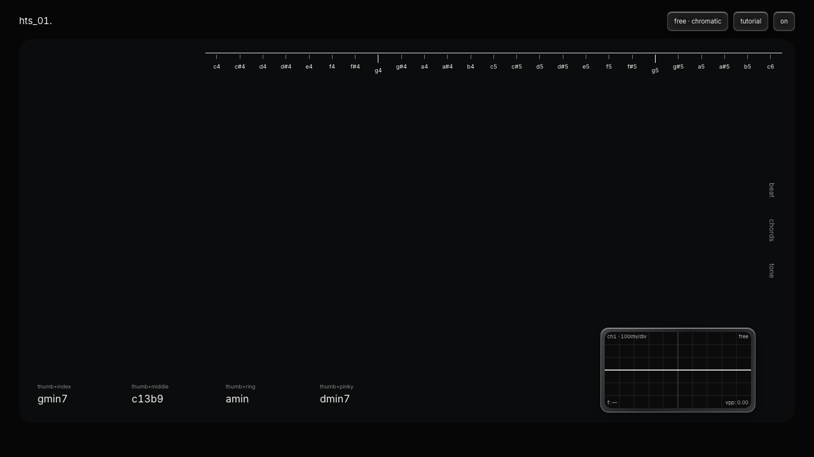
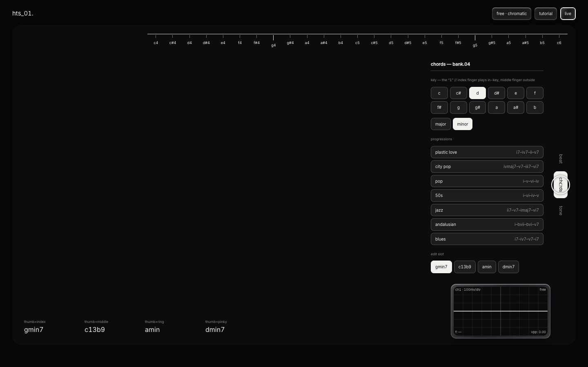
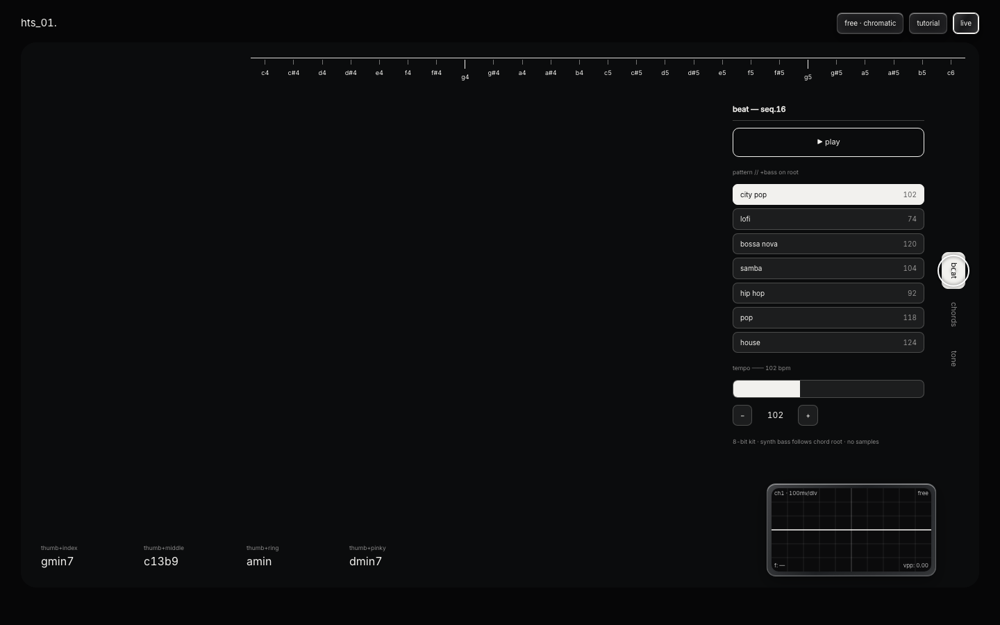

<div align="center">

# VOIDKEYS

### `[ hand-tracked synthesizer ]`

**Play music in the air. No keyboard. No MIDI. Just your hands.**

Your webcam tracks both hands in real-time — right hand plays melody,
left hand holds chords, wrist angle sweeps the filter. An 8-bit drum machine keeps time underneath.

Everything runs locally in the browser. Zero backend. Zero samples. Zero latency compromise.

[**Try it live →**](https://voidkeys-tawny.vercel.app)

---

`vite` · `react 19` · `typescript` · `mediapipe` · `web audio` · `webgl`

---

</div>

<br>

<div align="center">



<sub>The instrument stage — chromatic ruler across the top, four chord slots at the bottom, live oscilloscope</sub>

</div>

<br>

<div align="center">
<table>
<tr>
<td width="50%"></td>
<td width="50%"></td>
</tr>
<tr>
<td align="center"><sub><b>Chords panel</b> — key selector, progression presets, per-slot editing</sub></td>
<td align="center"><sub><b>Beat panel</b> — 7 drum patterns, tempo slider, all synthesized</sub></td>
</tr>
</table>
</div>

<br>

## How It Works

```
                    ┌─────────────────────────────────────────┐
                    │            YOUR WEBCAM FEED              │
                    │   ┌─────────────────────────────────┐   │
                    │   │   MediaPipe HandLandmarker (GPU) │   │
                    │   │   21 landmarks × 2 hands × 30fps│   │
                    │   └──────────┬──────────────────────┘   │
                    └──────────────┼──────────────────────────┘
                                   │
                    ┌──────────────▼──────────────────────────┐
                    │         ONE-EURO SMOOTHING               │
                    │    + per-finger touch hysteresis          │
                    └──────────────┬──────────────────────────┘
                                   │
              ┌────────────────────┼────────────────────────┐
              │                    │                        │
    ┌─────────▼─────────┐ ┌───────▼────────┐ ┌────────────▼───────┐
    │   RIGHT HAND      │ │   LEFT HAND    │ │   WRIST ANGLE      │
    │                    │ │                │ │                    │
    │  thumb+index →     │ │  thumb+finger  │ │  straight = neutral│
    │    white keys      │ │  → chord 1-4   │ │  clockwise = open  │
    │  thumb+middle →    │ │                │ │  counter = close   │
    │    black keys      │ │  staff card    │ │                    │
    │  thumb+ring →      │ │  follows hand  │ │  ±75° full range   │
    │    slide/glide     │ │                │ │                    │
    └───────────┬────────┘ └───────┬────────┘ └─────────┬──────────┘
                │                  │                     │
                └──────────────────┼─────────────────────┘
                                   │
                    ┌──────────────▼──────────────────────────┐
                    │          WEB AUDIO GRAPH                 │
                    │                                          │
                    │  oscillator → filter → delay → gain → 🔊│
                    │  + square-wave synth bass                │
                    │  + 8-bit drum machine (all synthesized)  │
                    └──────────────────────────────────────────┘
```

<br>

## Controls

| Input | Action |
|:------|:-------|
| **Right hand** thumb + index | Play **white keys** — position maps to pitch on the top ruler |
| **Right hand** thumb + middle | Play **black keys** (chromatic complement) |
| **Right hand** thumb + ring | **Slide** with 50ms glide |
| **Left hand** thumb + index/middle/ring/pinky | Hold **chord slots 1–4** |
| **Left wrist** tilt | **Sweep the filter** — clockwise opens, counter-clockwise closes |
| **Pinch knob** + twist | Turn any knob via wrist rotation (135° = full range) |
| **Mouse** | Full fallback — click, hold, drag. Everything works without a camera |

> Press **POWER** first — browsers require a user gesture to unlock audio.

<br>

## The Instrument

```
┌──────────────────────────────────────────────────────────────────┐
│                                                                  │
│  ┌─── BEAT ──────┐  ┌─── CHORDS ────┐  ┌─── TONE ────────────┐ │
│  │                │  │               │  │                     │ │
│  │  8-bit drums   │  │  progression  │  │  waveform selector  │ │
│  │  synth bass    │  │  presets      │  │  filter / resonance │ │
│  │  tempo 60-180  │  │  root × qual  │  │  attack / release   │ │
│  │                │  │  per slot     │  │  echo / volume      │ │
│  │  ▸ city pop    │  │               │  │  melody octave      │ │
│  │  ▸ lofi        │  │  ▸ city pop   │  │                     │ │
│  │  ▸ bossa nova  │  │  ▸ pop        │  │  ┌───────────────┐  │ │
│  │  ▸ samba       │  │  ▸ doo-wop    │  │  │ ∿∿∿ SCOPE ∿∿∿ │  │ │
│  │  ▸ hip hop     │  │  ▸ jazz       │  │  │  live phosphor │  │ │
│  │  ▸ pop         │  │  ▸ andalusian │  │  │  trace + freq  │  │ │
│  │  ▸ house       │  │  ▸ blues      │  │  │  + vpp readout │  │ │
│  │                │  │               │  │  └───────────────┘  │ │
│  └────────────────┘  └───────────────┘  └─────────────────────┘ │
│                                                                  │
└──────────────────────────────────────────────────────────────────┘
```

### Modes

| Mode | Behavior |
|:-----|:---------|
| **FREE** (default) | Chromatic slide — all 12 notes available |
| **AUTO** | Melody locks to chord-fitting scale — maj7 → ionian, min7 → dorian, dom7 → mixolydian, dim → locrian |

### Default Preset

```
Beat:    CITY POP @ 102 bpm
Chords:  Fmaj7 → G7 → Em7 → Am7   (the royal road: IVmaj7–V7–iii7–vi7)
Bass:    square wave, follows chord root
```

<br>

## Architecture

```
src/
├── audio/
│   ├── theory.ts          # scales, chord-scale pairings, MIDI utils
│   ├── SynthEngine.ts     # oscillator + filter + delay chain
│   └── DrumMachine.ts     # pattern sequencer, all synthesis (no samples)
├── gesture/
│   ├── types.ts           # hand event interfaces
│   ├── oneEuro.ts         # jitter filter for landmark smoothing
│   ├── tilt.ts            # wrist angle → filter sweep mapping
│   ├── classify.ts        # finger-pair → action classification
│   ├── useHandEvents.ts   # React hook: landmarks → gesture stream
│   └── GestureProvider.tsx# context provider for hand tracking state
├── instrument/
│   ├── Instrument.tsx     # main panel — BEAT / CHORDS / TONE sections
│   ├── GlassCanvas.tsx    # WebGL liquid-glass effect layer
│   ├── Knob.tsx           # rotary control (mouse drag + hand twist)
│   ├── StaffChord.tsx     # floating staff notation that follows your hand
│   └── TechScope.tsx      # triggered phosphor oscilloscope
├── components/
│   ├── HandOverlay.tsx    # landmark dot visualization
│   └── VideoBackdrop.tsx  # camera feed with adaptive shade
└── main.tsx               # entry point
```

<br>

## Tech Highlights

- **Zero samples** — every sound (kick, snare, hats, bass, melody) is synthesized live with Web Audio oscillators + noise
- **One-Euro filter** — adaptive smoothing eliminates hand-tracking jitter while preserving fast gestures
- **Liquid glass UI** — WebGL shader renders frosted-glass panels over the live camera feed
- **Adaptive shade** — backdrop dims automatically with room brightness so white UI always reads
- **Per-finger hysteresis** — prevents ghost touches from landmark noise near threshold
- **Chord-scale pairing** — AUTO mode uses music theory (ionian/dorian/mixolydian/locrian) to snap melody to harmonically correct notes
- **No backend** — webcam feed never leaves the device; MediaPipe runs entirely on-device via WASM + GPU

<br>

## Getting Started

```bash
git clone https://github.com/Piyushhhhh/voidkeys.git
cd voidkeys
npm install
npm run dev
```

Open `localhost:5173` — allow camera access when prompted.

> `predev` automatically copies MediaPipe WASM to `public/mediapipe/wasm`.
> The hand model loads from Google's CDN at runtime.

<br>

## Glass Lab

The [`glass-lab/`](glass-lab/) directory is a standalone WebGL playground for the liquid-glass shader — open `glass-lab/index.html` directly to experiment with refraction, blur, and chromatic aberration parameters.

<br>

---

<div align="center">

**built with mass and velocity**

</div>
